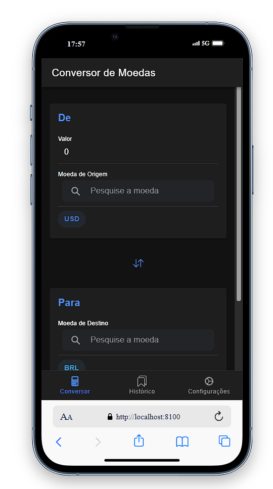
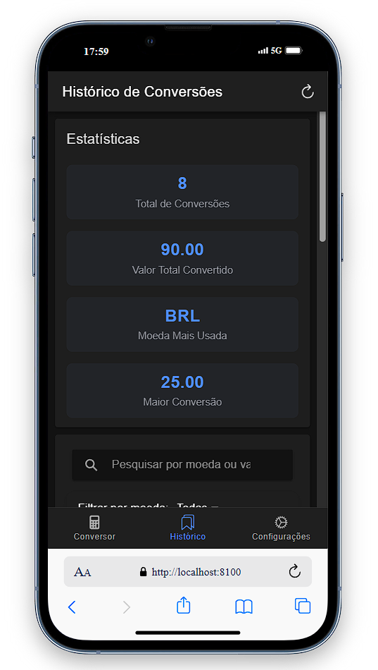
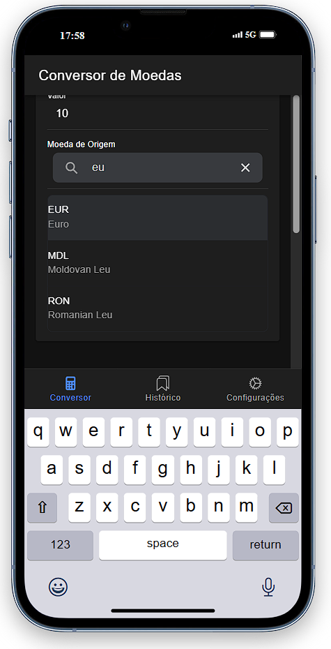

# 💱 Conversor de Moedas

Um aplicativo móvel moderno desenvolvido com **Ionic** e **Angular** para conversão de moedas em tempo real, com funcionalidades offline e histórico de conversões.

## 📱 Descrição do Projeto

O **Conversor de Moedas** é uma aplicação híbrida que permite aos usuários:

- ✅ **Conversão em tempo real** entre mais de 160 moedas
- 📊 **Histórico completo** de conversões com estatísticas
- 🔍 **Busca e filtros** avançados no histórico
- 📱 **Funcionalidade offline** com cache inteligente
- 🔄 **Repetir conversões** anteriores facilmente
- 📈 **Estatísticas detalhadas** do uso
- 💾 **Exportação de dados** em formato JSON
- 🎨 **Interface moderna** e responsiva

### 🏗️ Arquitetura

- **Frontend**: Ionic 7 + Angular
- **Armazenamento**: Ionic Storage (SQLite)
- **API**: ExchangeRate-API para taxas de câmbio
- **Funcionalidades offline**: Cache local com fallback

### 📋 Funcionalidades Principais

#### Tab 1 - Conversor
- Seleção de moedas com busca
- Conversão instantânea
- Troca rápida entre moedas
- Cache offline para uso sem internet
- Salvamento automático no histórico

#### Tab 2 - Histórico
- Lista completa de conversões
- Filtros por moeda e busca por texto
- Ordenação por data, valor ou moeda
- Estatísticas (total de conversões, moeda mais usada, etc.)
- Opções para deletar items individuais ou limpar tudo
- Exportação de dados
- Repetir conversões anteriores

## 📥 Como Baixar o Repositório

```bash
# Clone o repositório
git clone https://github.com/seu-usuario/conversor-moedas.git

# Entre no diretório do projeto
cd conversor-moedas

# Instale as dependências
npm install
```

## 🔧 Pré-requisitos

Antes de executar o projeto, certifique-se de ter instalado:

### Ferramentas Necessárias
- **Node.js** (versão 16 ou superior)
- **npm** ou **yarn**
- **Ionic CLI**: `npm install -g @ionic/cli`
- **Angular CLI**: `npm install -g @angular/cli`

### Para desenvolvimento móvel (opcional)
- **VsCode**
- **Capacitor CLI**: `npm install -g @capacitor/cli`

### Verificar instalação
```bash
# Verificar versões
node --version
npm --version
ionic --version
ng --version
```

## 🚀 Como Executar

### Desenvolvimento Web
```bash
# Executar no navegador
ionic serve

# Ou especificar porta
ionic serve --port=8100
```

### Build para Produção
```bash
# Build otimizado
ionic build --prod
```

### Executar em Dispositivos Móveis
```bash
# Adicionar plataforma Android
ionic capacitor add android

# Executar no Android
ionic capacitor run android

# Para iOS (apenas macOS)
ionic capacitor add ios
ionic capacitor run ios
```

## 🔑 Configuração da API

O projeto usa a **ExchangeRate-API**. A chave da API já está configurada no código, mas para uso em produção, recomenda-se:

1. Criar conta em [ExchangeRate-API](https://www.exchangerate-api.com/)
2. Obter sua chave gratuita
3. Substituir a chave no arquivo `tab1.page.ts`:

```typescript
private apiKey = "SUA_CHAVE_AQUI";
```

## 📊 Estrutura do Projeto

```
src/
├── app/
│   ├── tab1/          # Conversor principal
│   ├── tab2/          # Histórico e estatísticas
│   └── ...
├── assets/            # Recursos estáticos
└── theme/            # Estilos personalizados
```

## 🤝 Contribuindo

Contribuições são sempre bem-vindas! Para contribuir:

1. **Fork** o projeto
2. Crie uma **branch** para sua feature (`git checkout -b feature/AmazingFeature`)
3. **Commit** suas mudanças (`git commit -m 'Add some AmazingFeature'`)
4. **Push** para a branch (`git push origin feature/AmazingFeature`)
5. Abra um **Pull Request**

### 📝 Diretrizes de Contribuição

- Siga os padrões de código existentes
- Adicione testes para novas funcionalidades
- Atualize a documentação quando necessário
- Use mensagens de commit descritivas

### 🐛 Reportar Bugs

Para reportar bugs, use as [Issues do GitHub](https://github.com/seu-usuario/conversor-moedas/issues) incluindo:

- Descrição detalhada do problema
- Passos para reproduzir
- Screenshots (se aplicável)
- Informações do ambiente (SO, versão do app, etc.)

## 👥 Autores

- **João Albuquerque** - *Desenvolvimento inicial* - [@joaoalbuquerq](https://github.com/joaoalbuquerq)

### 🙏 Agradecimentos

- [ExchangeRate-API](https://www.exchangerate-api.com/) pelos dados de câmbio
- [Ionic Team](https://ionic.io/) pelo framework
- [Angular Team](https://angular.io/) pelo framework web
- Comunidade open source pelas bibliotecas utilizadas

## 📄 Licença

Este projeto está licenciado sob a **Licença MIT** - veja o arquivo [LICENSE](LICENSE) para detalhes.

### Resumo da Licença MIT

```
Copyright (c) 2024 Seu Nome

Permission is hereby granted, free of charge, to any person obtaining a copy
of this software and associated documentation files (the "Software"), to deal
in the Software without restriction, including without limitation the rights
to use, copy, modify, merge, publish, distribute, sublicense, and/or sell
copies of the Software, and to permit persons to whom the Software is
furnished to do so, subject to the following conditions:

The above copyright notice and this permission notice shall be included in all
copies or substantial portions of the Software.

THE SOFTWARE IS PROVIDED "AS IS", WITHOUT WARRANTY OF ANY KIND, EXPRESS OR
IMPLIED, INCLUDING BUT NOT LIMITED TO THE WARRANTIES OF MERCHANTABILITY,
FITNESS FOR A PARTICULAR PURPOSE AND NONINFRINGEMENT. IN NO EVENT SHALL THE
AUTHORS OR COPYRIGHT HOLDERS BE LIABLE FOR ANY CLAIM, DAMAGES OR OTHER
LIABILITY, WHETHER IN AN ACTION OF CONTRACT, TORT OR OTHERWISE, ARISING FROM,
OUT OF OR IN CONNECTION WITH THE SOFTWARE OR THE USE OR OTHER DEALINGS IN THE
SOFTWARE.
```

---

## 📱 Screenshots

<div align="center">
  
  ### Tela Principal - Conversor
  
  
  ### Histórico de Conversões
  
  
</div>

### 📸 Galeria Completa

| Conversor | Histórico | Filtros |
|-----------|-----------|---------|
|  |  |  |


## 🔄 Changelog

### v1.0.0
- ✨ Lançamento inicial
- 💱 Conversão básica de moedas
- 📊 Sistema de histórico
- 💾 Funcionalidade offline
- 📈 Estatísticas de uso

---

⭐ **Se este projeto foi útil para você, considere dar uma estrela no GitHub!**

📧 **Contato**: seu-email@exemplo.com